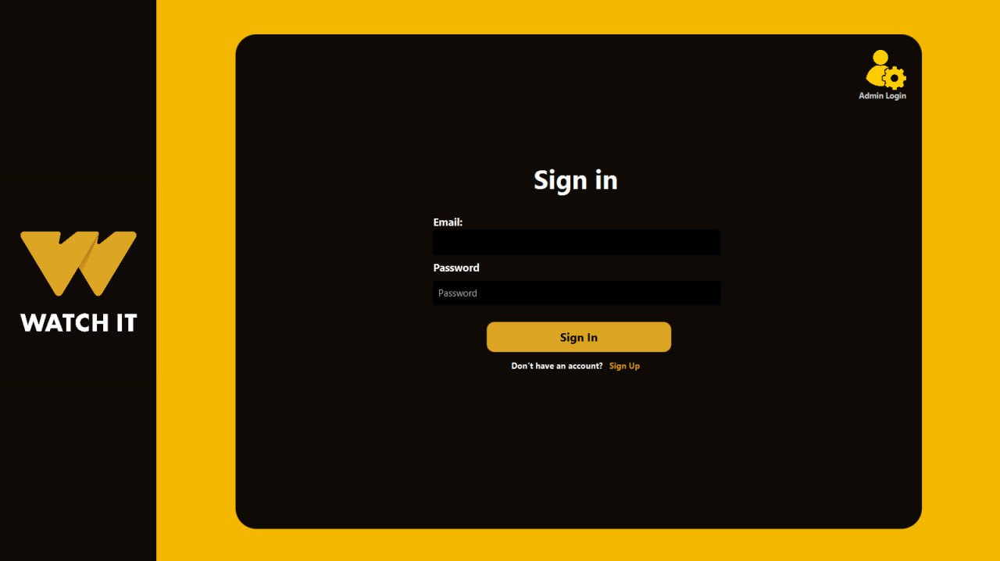
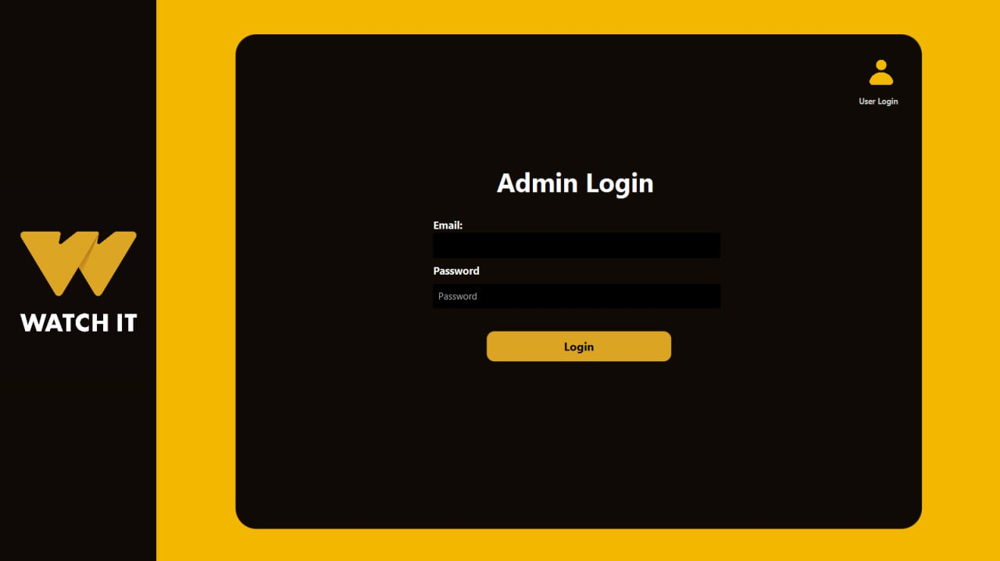
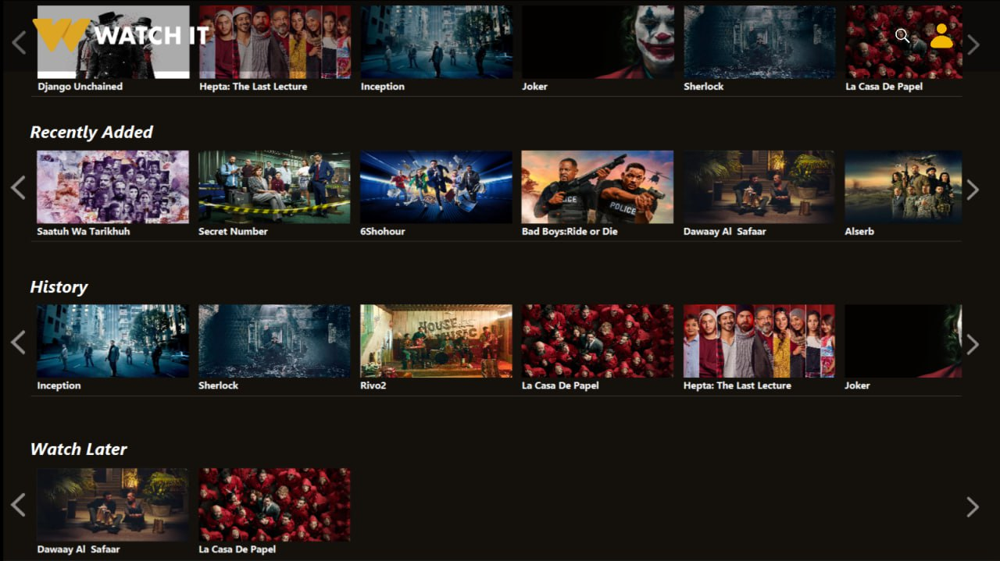
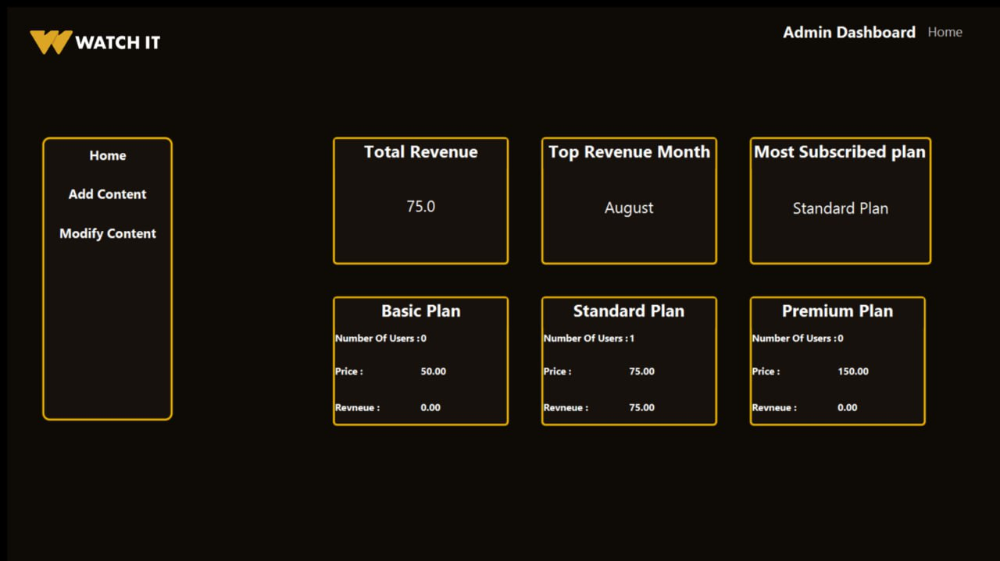

# 🎬 Watch It

This project is a **Java-based clone of the real streaming website "Watch It"**. Built entirely in **Java** with a **JavaFX GUI**, it demonstrates full **Object-Oriented Programming (OOP)** principles while allowing users to explore, rate, and manage movies and TV shows in a visually interactive interface.  

## 🚀 Features

- **Full OOP Design**: Classes, objects, inheritance, polymorphism, encapsulation, and abstraction are fully utilized to structure the system.  
- **Dynamic Search with DP**: Efficient searching of movies and TV shows using **dynamic programming** for fast lookups.  
- **User Accounts**: Users can create accounts, rate movies and TV shows, and maintain a personalized watchlist.  
- **Regex Validation**: Login and sign-up forms use **regular expressions (regex)** to ensure valid input for usernames, emails, and passwords.  
- **Admin Panel**: Admin login provides complete control—**add, update, or remove** movies and shows from the library.  
- **JavaFX GUI**: Modern graphical interface for smooth and interactive user experience.  
- **Detailed Information**: Access cast, synopsis, and ratings for each movie or TV show. 

## 🛠️ Installation

### Prerequisites

- **Java JDK** (v8 or higher)
- **JavaFX library**
- Any Java IDE or **Maven** for dependency management

### Steps

1. **Clone the repository**:
    
    ```bash
    git clone https://github.com/alimohamed7704/watch-it.git
    
    ```
    
2. **Navigate to the main project directory**:
    
    ```bash
    cd watch-it/main
    
    ```
    
3. **Compile the project**:
    
    ```bash
    javac *.java
    
    ```
    
4. **Run the application**:
    
    ```bash
    java Main
    
    ```


## 🖼️ Screenshots

- **User Login Page**
  
   

- **Admin Login Page**
  
   

- **Home Page**
  
   

   

- **Movie Screen**
  
   

- **Admin Dashboard**
  
   

- **Search**
  
    


## 🎯 Usage

- **Users**:
    - Sign up and log in to your account.
    - Browse or search movies and TV shows.
    - Add titles to your watchlist.
    - Rate movies and shows to influence personal recommendations.
- **Admins**:
    - Log in with admin credentials.
    - Add, update, or remove any movie or TV show.
    - Manage users and view ratings.
